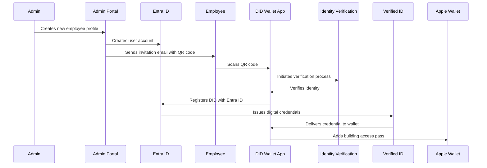
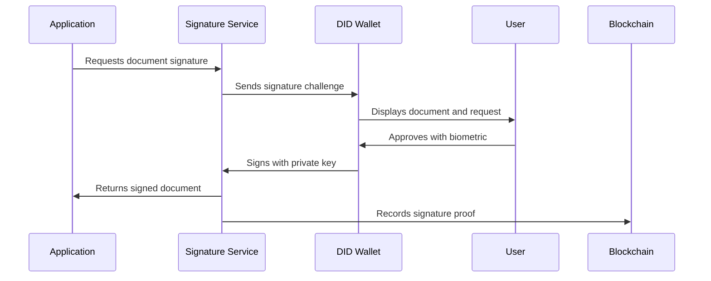

# Comprehensive Enterprise DID Wallet Solution

This document outlines the complete enterprise DID wallet ecosystem, including onboarding, identity verification, building access, digital signatures, encrypted communications, and administrative controls.

## Solution Architecture

The solution consists of these core components:

1. **DID Wallet App** (Web, iOS, Android)
2. **Administrator Portal**
3. **Identity Verification Service**
4. **Microsoft Entra ID & Verified ID Integration**
5. **Building Access System**
6. **Digital Signature Service**
7. **Secure Communication Gateway**

## 1. User Onboarding Process

### Administrator Invitation Flow



### Identity Verification Process

1. **Document Scanning**
   * User scans official ID (driver's license, passport)
   * OCR extracts document information
   * Document authenticity verified (holograms, patterns)
2. **Facial Recognition & Liveness Detection**
   * User takes selfie
   * Liveness checks (eye movement, head rotation)
   * AI compares selfie with ID photo
   * Match score calculated
3. **Risk Assessment**
   * Device reputation check
   * Location analysis
   * Behavioral biometrics
   * Multi-factor verification if needed

### Digital Badge Creation

After verification, the system:

1. Creates a Microsoft Verified ID credential
2. Issues building access credentials
3. Generates Apple/Google Wallet passes with:
   * Photo identification
   * NFC/QR capabilities
   * Access level indicators
   * Dynamic expiration based on employment status

## 2. Administrator Management Portal

### Key Features

1. **User Lifecycle Management**
   * Initiate onboarding
   * View verification status
   * Manage permissions
   * Offboard employees
2. **Access Control Management**
   * Set building/zone access levels
   * Create temporary access grants
   * Define time-based restrictions
   * Set up visitor credentials
3. **Audit & Compliance**
   * View access logs
   * Track authentication history
   * Export compliance reports
   * Investigate security incidents
4. **Real-time Revocation**
   * Immediate credential revocation
   * Emergency lockout capability
   * Batch revocation for departments
   * Selective permission removal

### Admin Interface Mockup

```
┌─ Administrator Portal ───────────────────────────────────┐
│                                                          │
│  ┌─ Users ─┐ ┌─ Access ─┐ ┌─ Audit ─┐ ┌─ Settings ─┐     │
│  └─────────┘ └──────────┘ └─────────┘ └────────────┘     │
│                                                          │
│  ┌─ User Management ──────────────────────────────────┐  │
│  │                                                     │  │
│  │  [New User] [Import] [Export] [Bulk Actions ▼]     │  │
│  │                                                     │  │
│  │  ┌─────────────────────────────────────────────┐   │  │
│  │  │ Name     | Email        | Status    | Actions│   │  │
│  │  ├─────────────────────────────────────────────┤   │  │
│  │  │ A. Smith | a@contoso.com| Active    | [···]  │   │  │
│  │  │ B. Jones | b@contoso.com| Pending   | [···]  │   │  │
│  │  │ C. Lee   | c@contoso.com| Suspended | [···]  │   │  │
│  │  └─────────────────────────────────────────────┘   │  │
│  │                                                     │  │
│  └─────────────────────────────────────────────────────┘  │
│                                                          │
└──────────────────────────────────────────────────────────┘
```

## 3. Building Access Integration

### Physical Access Control System

1. **Entry Point Integration**
   * NFC readers at entry points
   * QR code scanners as backup
   * Turnstiles/doorways with access control integration
   * Visitor management kiosks
2. **Access Verification Flow**
   ```
   User presents digital badge → Reader scans badge → Verifies against access control system → 
   Checks real-time permissions in Entra ID → Logs access event → Grants/denies access
   ```
3. **Multi-factor Options**
   * Badge + PIN for high-security areas
   * Badge + biometric for sensitive locations
   * Badge + supervisor approval for temporary access
4. **Emergency Protocols**
   * Offline verification capabilities
   * Emergency override procedures
   * Mass evacuation mode

### iOS Wallet Integration

```swift
// Example code for iOS wallet pass creation
import PassKit

func createBuildingAccessPass(for user: User, completion: @escaping (PKPass?) -> Void) {
    let passData = [
        "serialNumber": user.employeeID,
        "organizationName": "Contoso Corporation",
        "description": "Building Access",
        "logoText": "Contoso",
        "foregroundColor": "rgb(255, 255, 255)",
        "backgroundColor": "rgb(60, 90, 154)",
        "labelColor": "rgb(255, 255, 255)",
        "passTypeIdentifier": "pass.com.contoso.buildingaccess",
        "teamIdentifier": "TEAMID12345",
        "barcode": [
            "message": user.didUri,
            "format": "PKBarcodeFormatQR",
            "messageEncoding": "iso-8859-1"
        ],
        "generic": [
            "primaryFields": [
                [
                    "key": "name",
                    "label": "EMPLOYEE",
                    "value": user.fullName
                ]
            ],
            "secondaryFields": [
                [
                    "key": "title",
                    "label": "TITLE",
                    "value": user.jobTitle
                ],
                [
                    "key": "department",
                    "label": "DEPARTMENT",
                    "value": user.department
                ]
            ],
            "auxiliaryFields": [
                [
                    "key": "access",
                    "label": "ACCESS LEVEL",
                    "value": user.accessLevel
                ]
            ]
        ]
    ]
  
    // Create and sign the pass (implementation details omitted)
    let signedPass = createSignedPass(with: passData)
    completion(signedPass)
}
```

## 4. Digital Signatures & Approvals

### Signature Request Flow



### Implementation Considerations

1. **Document Handling**
   * Document preview in wallet
   * Secure document hash verification
   * Partial document signing
   * Multiple signature coordination
2. **Signing Mechanisms**
   * W3C Verifiable Credentials signatures
   * PKI certificate integration
   * Blockchain anchoring option
   * Compliance with eIDAS/ESIGN standards
3. **Legal Admissibility**
   * Timestamp authority integration
   * Audit trail of signature process
   * Evidence package for each signature
   * Long-term signature validation

## 5. Encrypted Email via Outlook

### Email Encryption Architecture

1. **Key Management**
   * DID-based key pairs for email encryption
   * Key rotation policies
   * Key recovery mechanisms
   * HSM integration for enterprise keys
2. **Outlook Integration Options**
   * Microsoft Information Protection integration
   * S/MIME certificate issuance based on DIDs
   * Add-in for Outlook desktop/web
   * Mobile app extension
3. **User Experience Flow**
   ```
   User composes email → Clicks "Send Encrypted" → 
   Email service looks up recipient's public key → 
   Content encrypted with recipient's key → 
   Recipient receives notification → 
   Recipient authenticates with DID wallet → 
   Email decrypted and displayed
   ```

### Technical Implementation

```javascript
// Example: Encrypting email content with recipient's public key
async function encryptEmailForRecipient(emailContent, recipientDID) {
  // Lookup recipient's public key from DID
  const recipientDIDDocument = await resolveDID(recipientDID);
  const encryptionKey = recipientDIDDocument.keyAgreement[0].publicKeyJwk;
  
  // Generate a random content encryption key
  const contentEncryptionKey = await window.crypto.subtle.generateKey(
    { name: "AES-GCM", length: 256 },
    true,
    ["encrypt", "decrypt"]
  );
  
  // Encrypt the email content with the content encryption key
  const iv = window.crypto.getRandomValues(new Uint8Array(12));
  const encryptedContent = await window.crypto.subtle.encrypt(
    { name: "AES-GCM", iv },
    contentEncryptionKey,
    new TextEncoder().encode(emailContent)
  );
  
  // Encrypt the content encryption key with the recipient's public key
  const encryptedKey = await encryptRecipientKey(contentEncryptionKey, encryptionKey);
  
  // Return the encrypted package
  return {
    encryptedContent: arrayBufferToBase64(encryptedContent),
    encryptedKey: encryptedKey,
    iv: arrayBufferToBase64(iv),
    algorithm: "AES-GCM-256",
    recipientDID: recipientDID
  };
}
```

## 6. Authentication History & Transparency

### Challenge History Dashboard

1. **User-facing Dashboard**
   * Timeline of all authentication events
   * Details about requesting applications
   * Geographic location and device information
   * Anomaly indicators for suspicious requests
2. **Data Retention**
   * Configurable history retention periods
   * Privacy-preserving data minimization
   * Exportable personal data (GDPR compliance)
   * Audit logs for security investigations
3. **Notifications & Alerts**
   * Push notifications for authentication attempts
   * Location-based anomaly detection
   * New device warnings
   * Periodic authentication summaries

### Data Structure

```javascript
const authenticationEvent = {
  id: "auth-123456",
  timestamp: "2025-04-03T14:22:31Z",
  type: "authorization",
  application: {
    name: "Microsoft SharePoint",
    id: "app-sp-123",
    icon: "https://example.com/sp-icon.png"
  },
  request: {
    scopes: ["files.read", "files.write"],
    resources: ["https://contoso.sharepoint.com/sites/project-x"],
    challenge: "base64-encoded-challenge-data"
  },
  device: {
    id: "dev-456",
    name: "Windows Laptop (Surface Pro)",
    type: "desktop",
    fingerprint: "device-fingerprint-hash"
  },
  location: {
    ip: "198.51.100.42",
    city: "Seattle",
    country: "United States",
    coordinates: {
      latitude: 47.6062,
      longitude: -122.3321
    }
  },
  result: {
    status: "approved",
    authenticatedAt: "2025-04-03T14:22:45Z",
    authenticationType: "biometric",
    verificationLevel: "strong"
  }
};
```

## 7. Administrative Revocation

### Revocation Mechanisms

1. **Immediate Revocation Triggers**
   * Termination of employment
   * Security incident
   * Lost/stolen device
   * Suspicious activity
   * Role change requiring re-verification
2. **Technical Implementation**
   ```
   Admin initiates revocation → System updates status in Entra ID → 
   Revocation pushed to Verified ID status registry → 
   Real-time status check services updated → 
   Push notification sent to device → 
   Wallet app displays revocation notice
   ```
3. **Revocation Effects**
   * DID credentials marked as revoked
   * Building access denied
   * Authentication requests rejected
   * Document signing disabled
   * Apple/Google Wallet passes invalidated

### Partial vs. Complete Revocation

* **Partial** : Remove specific credentials or permissions
* **Temporary** : Time-bound suspension of access
* **Conditional** : Restrict to specific networks/locations
* **Complete** : Full invalidation of all access

## 8. Security & Privacy Considerations

### Security Architecture

1. **Key Protection**
   * Hardware-backed key storage
   * Biometric protection for signing operations
   * Key fragmentation across secure elements
   * Anti-cloning measures
2. **Privacy Preserving Design**
   * Selective disclosure of identity attributes
   * Zero-knowledge proofs for validation
   * Minimal data collection
   * Purpose limitation compliance
3. **Threat Modeling**
   * Protection against phishing
   * Mitigations for lost/stolen devices
   * Defenses against API attacks
   * Replay protection for authentication

## 9. Compliance & Governance

### Regulatory Alignment

1. **Identity Standards**
   * W3C Verifiable Credentials/DID standards
   * NIST 800-63-3 IAL2/AAL2/FAL2 compliance
   * ISO/IEC 29115 Level of Assurance
   * FIDO2 certification
2. **Privacy Regulations**
   * GDPR/CCPA compliance architecture
   * Data minimization principles
   * Right to be forgotten implementation
   * Transparency and consent management
3. **Industry-Specific Compliance**
   * Healthcare: HIPAA considerations
   * Finance: KYC/AML capabilities
   * Government: FedRAMP alignment
   * Critical infrastructure: NERC CIP support

## Implementation Roadmap

### Phase 1: Core Infrastructure (3 months)

* DID wallet app development (Web, iOS, Android)
* Administrator portal basic functionality
* Microsoft Entra ID integration
* Basic Microsoft Verified ID issuance

### Phase 2: Identity Verification (2 months)

* Document scanning implementation
* Facial recognition & liveness detection
* Identity verification service integration
* Digital badge creation

### Phase 3: Building Access (3 months)

* Apple/Google Wallet integration
* Building access control system integration
* NFC/QR reader configuration
* Access control management in admin portal

### Phase 4: Advanced Features (4 months)

* Digital signature service
* Encrypted email via Outlook
* Authentication history dashboard
* Advanced administrative controls

### Phase 5: Security Hardening & Compliance (2 months)

* Security penetration testing
* Privacy impact assessment
* Compliance validation
* Performance optimization

## Technical Requirements

1. **Development Technologies**
   * Frontend: React (Web), Swift (iOS), Kotlin (Android)
   * Backend: Node.js, ASP.NET Core
   * Identity: DID libraries, Verified ID SDK
   * Cryptography: WebAuthn, JOSE libraries
2. **Microsoft Ecosystem Integration**
   * Microsoft Entra ID B2C
   * Microsoft Verified ID
   * Microsoft Graph API
   * Microsoft 365 apps integration
3. **Third-party Services**
   * Document verification service
   * Facial recognition provider
   * Building access control systems
   * Digital signature validation
4. **Infrastructure**
   * Azure cloud hosting
   * Hardware security modules
   * CI/CD pipelines
   * Monitoring and alerting

## Conclusion

This comprehensive enterprise DID wallet solution delivers a complete identity ecosystem that addresses all requirements:

* Secure employee onboarding with facial recognition and ID verification
* Digital badges in Apple/Google Wallet for building access
* Integration with Microsoft Entra ID and Verified ID
* Digital signatures for document approval
* Encrypted email capabilities
* Authentication history tracking
* Administrative controls for credential management

The implementation follows a phased approach, allowing for iterative deployment and refinement while maintaining security and compliance throughout the process.
